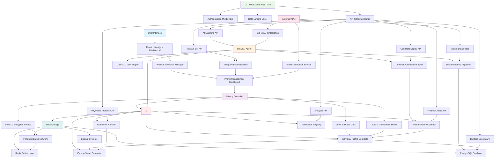
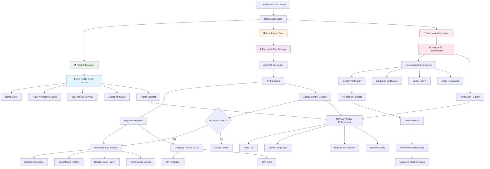
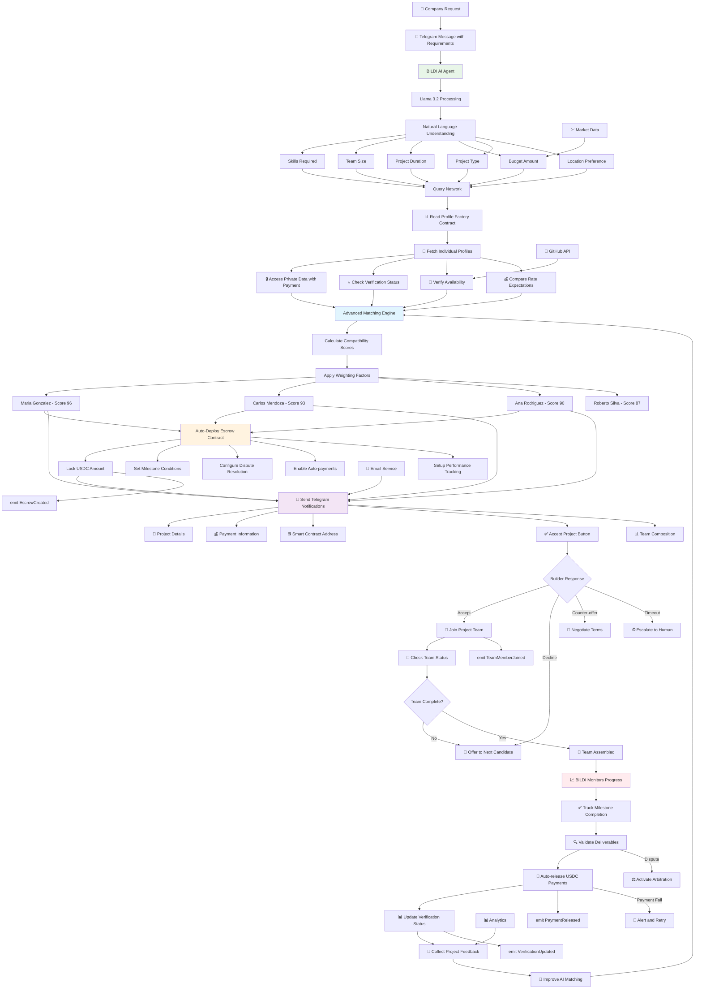

# LATAM Builders x SOVRA 
## The First Professional Directory for Web3 LATAM

[](https://llama.meta.com)
[](https://ipfs.io)

## **Project Overview**

LATAM Builders is a revolutionary decentralized professional directory that connects top Web3 talent across Latin America with global opportunities. Built on BlockDAG Network for superior performance and cost-efficiency.

### **Overall Key Features**
- **LATAM Focus** - Specialized for Latin American market with expansion in mind 
- **AI Agent "BILDI"** - Automated talent matching
- **Innovative Data collection and reputation system** - Through API and proprietary development
- **Payment System Integration** - innovative approach to split the payment btw LB and data owner
- **Three-Layer Privacy** - Granular data protection  
- **Utility Token Integration** - Native token utility and staking

---

## 🏗️ **1. Complete System Architecture**



---

## 🔐 **2. Privacy Architecture - Three-Layer System**



---

## 🤖 **3. BILDI AI Agent - Complete Workflow**



---

## 🌐 **4. REST API Architecture**

```mermaid
graph TD
    %% API Gateway
    A[🌐 API Gateway] --> B[🔐 Authentication Layer]
    B --> C[Rate Limiting]
    C --> D[Request Analytics]
    D --> E[Load Balancer]
    
    %% Authentication Methods
    B --> F[JWT Tokens]
    B --> G[Wallet Signature]
    B --> H[OAuth 2.0]
    B --> I[API Keys]
    
    %% Core API Endpoints
    E --> J[Builders API]
    E --> K[Companies API]
    E --> L[AI Matching API]
    E --> M[Payments API]
    E --> N[Analytics API]
    E --> O[Contracts API]
    
    %% Builders API Endpoints
    J --> P[Get Builders List]
    J --> Q[Create Builder Profile]
    J --> R[Update Builder Info]
    J --> S[Get Builder Profile]
    J --> T[Verify Builder]
    J --> U[Search Builders]
    
    %% Companies API Endpoints
    K --> V[Get Companies List]
    K --> W[Register Company]
    K --> X[Create Company Project]
    K --> Y[Get Hired Builders]
    K --> Z[Submit Company Feedback]
    
    %% AI Matching API
    L --> AA[AI Match Request]
    L --> BB[Get AI Recommendations]
    L --> CC[Submit AI Feedback]
    L --> DD[Get AI Analytics]
    L --> EE[Train AI Model]
    
    %% Payments API
    M --> FF[Process USDC Payment]
    M --> GG[Get Payment Status]
    M --> HH[Create Escrow]
    M --> II[Release Payment]
    M --> JJ[Get Payment History]
    
    %% Analytics API
    N --> KK[Builders Analytics]
    N --> LL[Projects Analytics]
    N --> MM[Revenue Analytics]
    N --> NN[Verification Analytics]
    N --> OO[Market Analytics]
    
    %% Contracts API
    O --> PP[Deploy Smart Contract]
    O --> QQ[Get Contract Info]
    O --> RR[Interact with Contract]
    O --> SS[Get Contract Events]
    O --> TT[Verify Contract]
    
    %% Backend Services
    P --> UU[🗄️ PostgreSQL Database]
    AA --> VV[AI Engine Service]
    FF --> WW[Stablecoin Handler]
    KK --> XX[Analytics Engine]
    PP --> YY[Contract Factory]
    
    %% External Integrations
    VV --> ZZ[Llama 3.2 API]
    WW --> AAA[USDC/USDT Network]
    XX --> BBB[Data Visualization]
    U --> CCC[Elasticsearch]
    
    %% Response Formats
    UU --> DDD[JSON Response]
    VV --> EEE[AI Match Results]
    WW --> FFF[Transaction Data]
    XX --> GGG[Analytics Dashboard]
    
    %% Error Handling
    D --> HHH[Error Logging]
    HHH --> III[Alert System]
    HHH --> JJJ[Error Analytics]
    
    %% Caching Layer
    UU --> KKK[⚡ Redis Cache]
    CCC --> KKK
    BBB --> KKK
    
    %% Security Features
    C --> LLL[DDoS Protection]
    C --> MMM[Data Encryption]
    C --> NNN[Audit Logging]
    
    style A fill:#e1f5fe
    style J fill:#e8f5e8
    style L fill:#fff3e0
    style M fill:#f3e5f5
    style N fill:#ffebee
    style O fill:#e0f2f1
```



---

##  **5. Economics & Stablecoin Flow**

```mermaid
graph TD
    %% Payment Sources
    A[Payment System] --> B[Companies Purchase USDC Access]
    A --> C[Builders Earn USDC]
    A --> D[Platform Operations]
    
    %% Company Payment Flow
    B --> E[Pay for Private Data Access]
    B --> F[Fund Project Escrows]
    B --> G[Premium Features]
    B --> H[Priority Matching]
    
    %% Builder Earning Flow
    E --> I[Builder receives 80% in USDC]
    F --> J[Project completion payments]
    G --> K[Feature access rewards]
    H --> L[Visibility boost fees]
    
    %% Platform Revenue
    E --> M[Platform receives 20% USDC]
    J --> N[5% platform fee]
    G --> O[Subscription revenue]
    H --> P[Service fees]
    
    %% Payment System Features
    Q[USDC/USDT System] --> R[Payment Medium]
    Q --> S[Instant Settlements]
    Q --> T[Low Transaction Fees]
    Q --> U[AI Agent Operations]
    Q --> V[Security Deposits]
    
    %% Verification System
    S --> W[Builder verification process]
    S --> X[KYC/Identity validation]
    S --> Y[Performance tracking]
    S --> Z[Quality assurance]
    
    %% Platform Features
    T --> AA[Access to premium features]
    T --> BB[Enhanced search visibility]
    T --> CC[Priority support]
    T --> DD[Advanced analytics]
    
    %% AI Operations Costs
    U --> EE[BILDI matching computations]
    U --> FF[Smart contract deployments]
    U --> GG[Automated operations]
    U --> HH[ML model training]
    
    %% Security and Trust
    V --> II[Project escrow deposits]
    V --> JJ[Dispute arbitration bonds]
    V --> KK[Anti-spam measures]
    V --> LL[Identity verification fees]
    
    %% Cost Comparison Analysis
    MM[Network Advantages] --> NN[0.001 USD per transaction]
    MM --> OO[24 USD per month for 1000 builders]
    MM --> PP[97% cheaper than competitors]
    MM --> QQ[10000+ TPS capacity]
    
    %% Revenue Streams
    RR[Platform Revenue] --> SS[🔐 Private data access fees]
    RR --> TT[Project platform fees]
    RR --> UU[Premium subscriptions]
    RR --> VV[Enterprise API access]
    RR --> WW[Analytics and insights]
    
    %% Revenue Distribution
    SS --> XX[Operational costs]
    TT --> XX
    UU --> XX
    VV --> XX
    WW --> XX
    
    %% Growth Mechanisms
    XX --> YY[Platform development]
    XX --> ZZ[Marketing and growth]
    XX --> AAA[Builder incentives]
    
    %% Network Effects
    BBB[Network Growth] --> CCC[More builders = more value]
    BBB --> DDD[More companies = higher demand]
    BBB --> EEE[Better AI = better matches]
    BBB --> FFF[Higher transaction volume]
    
    %% Sustainability Model
    GGG[Sustainable Economics] --> HHH[Self-funding through fees]
    GGG --> III[Data-driven fee optimization]
    GGG --> JJJ[Performance-based rewards]
    GGG --> KKK[Continuous value creation]
    
    style A fill:#e8f5e8
    style Q fill:#fff3e0
    style MM fill:#e1f5fe
    style RR fill:#f3e5f5
    style BBB fill:#ffebee
    style GGG fill:#e0f2f1
```



---

##  **Quick Start**

### **Prerequisites**
- Node.js 18+
- Yarn or npm
- EVM compatible wallet
- PostgreSQL 14+
- Redis 6+

---

## 🛠️ **Development Roadmap**

### **Phase 1: Foundation (Months 1)**
- Frontend (Directory v2):
1. Directory V2.0 – part 1:
1.1 UX/UI redesign (multi-language ready)
1.2 Wallet connect integration.
1.3 Security baseline (auth flows, session handling).
1.4 Built-in survey for onboarding builders.
1.5 Basic analytics (dashboards for admins).

Backend & Infra (API v1 + Factory Smart Contracts MVP):
1. API v1 (core infra):
1.1 DB setup
1.2 wallet authentication
1.3 basic conversation endpoints
1.4 Telegram integration

2. Factory Smart Contract (MVP):
2.1 Profile creation (3 roles: builders, company, PM); 
2.2 Link profiles to wallet IDs; 
2.3 Basic identity verification via API (not on-chain yet); 
2.4 Placeholder for 3 layers of privacy (design + stub functions).

3 Payment infra (skeleton only):
3.1 Escrow contract stub.
3.2 Split payments skeleton defined (not audited, not production-ready).
3.3 On/Off ramp integration design (API hooks).

4 Data Collection v1: store initial survey responses in DB.

**Phase 1: Foundation (Months 2)**
- Frontend (Directory):
1. Directory V2.0 - part 2:
1.1 Full UX/UI refinements,
1.2 Multi-language support.
1.3 Wallet connect stabilization + enhanced security.
1.4 Built-in survey live and connected to DB.
1.5 Onboarding of 300–500 verified builders (with light verification/KYC-lite if possible). 
1.6 Mobile app development kickoff: MVP screens, login/wallet connect, referral program.
1.7 Advanced analytics dashboard for admins.

- Backend & Infra
1. API v2:
1.1 Expansion to other communication channels.
1.2 Integration with BILDI AI Agent v1.0.
1.3 Basic performance analytics endpoints.

2. BILDI AI Agent v1.0:
2.1 Works with initial survey DB (Data Collection v1).
2.2 Notifications & Telegram integration.

3. Factory Smart Contract:   
3.1 Extend testing of escrow
3.2 Split payments (from M1 skeleton) with simulated flows (no audit yet).


### **Phase 1: Foundation (Months 3)**

- Frontend (Directory):
1. Implementation tests & adjustments of privacy layers in the directory (3 levels of data visibility).

2. UI updates for data privacy controls (builder can manage what's public, semi-private, or confidential).

3. Early builder feedback loop → refinements from first 300–500 onboarded users.

- Backend & Infra:
1 BILDI AI Agent v2.0 (AI Engineering):
1.1 Vector database for embeddings (builder profiles + activity).
1.2 Smart contract automation for selected flows (e.g., verification checkpoints, payments).
1.3 Multi-channel communication (expand beyond Telegram).
1.4 Predictive analytics engine (early recommendations on builder–company matches).
1.5 Design and prepare real-time learning system (architecture, data pipelines)
  
2. Data Collection System v2.0:
2.1 Add scraping modules (on-chain + off-chain).
2.2 Integrate push-notification quick questions and responses directly into DB (with API/BILDI sync to ensure up-to-date data).
2.3 Keep history for longitudinal tracking of builders.
   
3. Verification System (architecture confirmation):
3.1 Define process combining on-chain activity, off-chain contributions, and social validation.
3.2 Set design for weekly updates of verification status.

### **Phase 2: Enhancement (Months 4-5)**
- Frontend (Directory 3.0):
1. Launch first B2B features:
1.1 Company dashboards
1.2 Advanced search & filtering for builders
1.3 Bulk data access (buy/export builder datasets).
1.4 UI for verification status display (visual badge, levels).
5 Premium data products: (e.g., ecosystem reports, custom queries)  

2. UX refinements from builder/company feedback.

3. Insights & benchmarks (ecosystem metrics, comparisons, trends).


- Backend & Infra:
1. Data Collection System v2.0 (implementation):
1.1 Full integration of scraping (on-chain + off-chain) into DB.

2. Verification System (implementation):
2.1 Deploy verification engine based on architecture confirmed in M3.
2.2 Automate weekly updates of verification status.

3. BILDI AI Agent v2.0:
3.1 Implement real-time learning system (feedback loop active in production).
3.2 Implement real-time learning loop (feedback → recommendations).
   
4. Security:
4.1 Internal Security Vulnerability Assessment: Smart contracts, audit of escrow, split, and profile contracts.
4.2 API stress testing → verify scaling under heavy load.
4.3 Internal security vulnerability assessment.
4.4 Implement internal audit feedback & final adjustments across smart contracts, API, and infra.

5. Infrastructure optimization: DB indexing, caching, load balancing.

### **Phase 3: Audit & Scale Readiness (Months 6-7)**
- Frontend (Directory):
1. Bug fixing and polishing user experience.

2. Performance optimization for large-scale directory searches and dashboards.

3. Security:
3.1 Usability improvements based on audit findings.
3.2 Final polish for B2B flows and dashboards.

- Backend & Infra:
1. Audit readiness adjustments (documentation, test coverage).

2. Monitoring & observability setup (logs, tracing, alerts).

3. External audit kickoff (infra + penetration testing global).
3.1 External audit results → implement fixes across smart contracts, API, infra.

4. Scalability & stability testing under real-world conditions (simulate thousands of builders/requests).
4.1 Final optimization for scale launch.

---

## **API Documentation**

### **Core Endpoints**

```bash
# Builders API
GET    /api/v1/builders              # List all builders
POST   /api/v1/builders/create       # Create new builder profile
PUT    /api/v1/builders/{id}         # Update builder profile
GET    /api/v1/builders/{id}/profile # Get specific builder
GET    /api/v1/builders/search       # Search builders

# Companies API  
POST   /api/v1/companies/register    # Register company
POST   /api/v1/companies/{id}/projects # Create project
GET    /api/v1/companies/{id}/hired  # Get hired builders

# AI Matching
POST   /api/v1/ai/match              # Get AI recommendations
POST   /api/v1/ai/feedback           # Submit feedback

# Payments
POST   /api/v1/payments/process      # Process USDC payment
POST   /api/v1/payments/escrow       # Create escrow
POST   /api/v1/payments/release      # Release payment

# Smart Contracts
POST   /api/v1/contracts/deploy      # Deploy new contract
GET    /api/v1/contracts/{address}   # Get contract info
POST   /api/v1/contracts/interact    # Interact with contract
```

---

## 📜 **Smart Contracts**

### **Deployed Contracts**

```solidity
// Profile Factory Contract
contract ProfileFactory {
    address public constant PROFILE_FACTORY = 0x...;
    address public constant ESCROW_FACTORY = 0x...;
    address public constant VERIFICATION_REGISTRY = 0x...;
    address public constant USDC_TOKEN = 0x...;
}
```

---

## **Security**

### **Security Measures**
TBD
- Smart contract audits by leading firms
- Multi-signature wallet controls
- Rate limiting and DDoS protection
- Encrypted data storage
- Regular security assessments

## **Community**

### **Join the LATAM Builders Community**
- [Website](https://latambuilders.xyz)

### **Partners & Supporters**
- **BlockDAG Network** - Partners 
- **Meta Llama** - AI Technology
- **LATAM Web3 Communities** - Ecosystem Partners


---

## 🙏 **Acknowledgments**

Special thanks to:
- BlockDAG Network team for the support, mentorship, and finantial support 
- LATAM Web3 community for continuous feedback
- All beta testers and early adopters
- Open source contributors

---

**Made with ❤️ by the LATAM Builders team**
